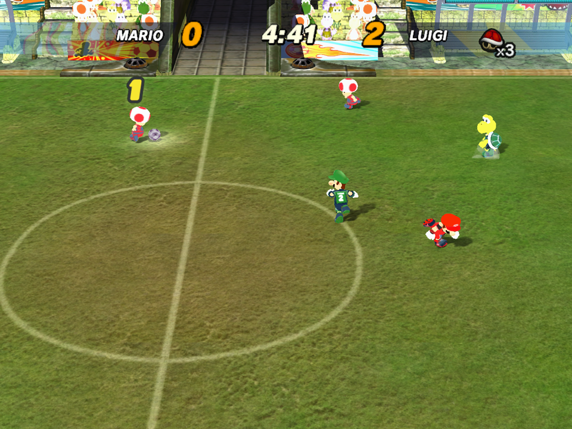
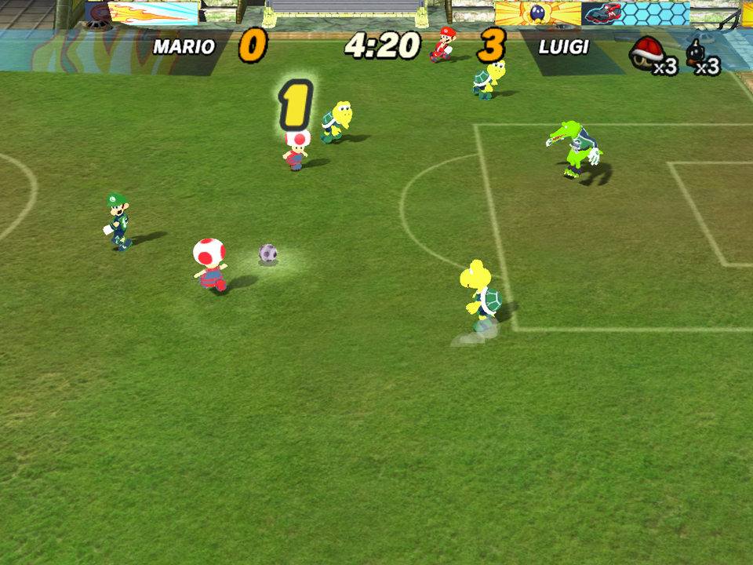

# openstrikers

A native port of the *Super Mario Strikers* (GameCube, NTSC-U) decompilation.

The game's own C++ is taken unmodified from [`smstrikers-decomp`][decomp]; the
GameCube system libraries it calls (GX, OS, PAD, VI, CARD, DVD, MTX) are
supplied by [`aurora`][aurora], which re-implements them on top of SDL3 and
WebGPU/Dawn. This repository is the glue: a CMake build, an entry point, a set
of compatibility shims, and the patch stack that makes 2005 PowerPC/Metrowerks
sources compile and run as a 64-bit little-endian host binary.

**You must supply your own disc image.** No game data is distributed here.

Current known problems are tracked in [`ISSUES.md`](ISSUES.md).





Both captured from the current build with `capture.ps1`. The flat lime-green
keeper in the second shot is the open material/lighting issue, not an artifact
of the capture.

---

## Status

| | |
|---|---|
| Windows (native, MSYS2 UCRT64) | front end complete; a match loads and runs -- `smoke-test.ps1` passes |
| Linux / WSL (GCC) | builds and boots (not re-verified since the render/input work) |
| Rendering | 2D/front end, the in-match HUD, stadium and animated characters draw correctly; lighting and some background surfaces are still wrong -- see `ISSUES.md` |
| Characters | stay planted on the pitch -- see [Characters floated because a mirrored blend read a dead stack slot](#characters-floated-because-a-mirrored-blend-read-a-dead-stack-slot) |
| 3D models | `.bmd` loads (342 models for the palace) plus skin meshes; shared-array geometry corruption is fixed -- see [The match rendering fix](#the-match-rendering-fix) |
| Leaving a match | quitting from the pause menu returns to the main menu and keeps running |
| Replays | snapshot playback completes on the 64-bit host; pointer-width and highlight-layout faults fixed |
| Input | keyboard on port 0, plus any SDL gamepad, paced to 60 Hz |
| Memory card | creates, writes and reads its save file |
| Audio | disabled (`GOLDEN_DISABLE_AUDIO`) |

The game boots, loads the front-end `.fen` scene package, runs its timeline
animations, presents the health-and-safety screen, checks the memory card,
creates its save file if there is not one, and lands on a real, navigable front
end with correctly localized text. The legal/logo sequence cross-fades
correctly, the main menu works, and an exhibition match can be set up all the
way through: captain grid, sidekick grid, the choose-a-side widget, and stadium
select. Picking a stadium tears down the front end and starts loading the match.

### A match now loads and runs

`smoke-test.ps1` sets `OPENSTRIKERS_SKIP_FE=1`, starts Mario vs Luigi at Peach &
Toad Stadium, waits for the `-- Memory upon Exiting InitializeGameState` marker
on stderr and then watches the process stay alive. It passes, and holds for 90
seconds. Six bugs stood between "the load reaches the first frame" and that, and
three of them are new classes worth stating on their own.

- **The display list is big-endian everywhere it is read on the CPU, not just in
  `DrawableModel`.** `NetMeshModelLoader::LoadGeometryFromModel` and
  `ReadEdgesFromGeometryPacket` and `ModeledScreenTransition::RenderOutline` each
  walk a `DisplayList` and read a vertex index out of it natively. The net-mesh
  loader takes `max(index) + 1` as its particle count, so a true maximum of 255
  came back as 65280 and `DrawableNetMesh::Render` asked the frame allocator for
  783372 bytes of vertex memory out of a 896 KB arena. The rule from
  `GetAABBDimensions` holds everywhere: **anything read back out of a GX display
  list on the CPU has to be swapped.**
- **A by-value base subobject that the game constructs a derived type into is a
  devirtualisation trap.** `Event::m_data` is declared `EventData m_data;` and
  every event placement-news its own payload -- `NISData`, `GoalScoredData`,
  `PenaltyData` -- on top of it. A compiler may assume a by-value member's
  dynamic type is its declared type, and GCC duly folded `m_data.GetID()` to
  `EventData::GetID()`, which answers -1. `Event::GetData` therefore decided
  *every* event in the game carried no payload and handed back NULL, and the
  first handler to use one without checking took the process down. The payload is
  now reached only through `Event::Data()`/`Event::Payload()`, which
  `std::launder`, and the ~200 `m_data` uses go through them.
- Those same events were being built at the wrong offset. The GameCube header
  ahead of the payload is 0x10 bytes, so 46 sites spell
  `new ((u8*)pEvent + 0x10) Foo()`. Two 8-byte ring pointers put `m_data` at 0x18
  here, so the literal landed the payload's vtable pointer on
  `m_uEventID`/`m_nReferenceCount` and `DispatchEvents` indexed `m_dest` with the
  low half of a code address. The pool stride grew too: every size handed to
  `CreateValidEvent` is a GameCube total, and a GC-sized slot no longer holds the
  object placed in it.
- **A `void`-in-practice function that is declared to return a pointer.**
  `ModeledScreenTransition::LoadFromParser` is declared
  `ModeledScreenTransition*` and returns nothing; every caller ignores the value,
  so on PowerPC it was merely untidy. GCC emits no return at all and control runs
  into whichever function it laid down next -- one `model` line in the transitions
  script became a million `cPoseAccumulator` allocations and an exhausted heap.
  This is the third instance of this class in the port, after
  `SidelineExplodableTextureLoadCallback` and `FileWriteIconCB`; `-Wreturn-type`
  is on, and the build log is now clean of it.
- `parse_group` in `EffectsGroup.cpp` indexes its 64-entry stack array of
  `EffectsSpec` by shifting a running byte offset right by 6, because the struct
  is 0x40 bytes on the GameCube. Two pointers inside it grow here, so the shift
  picked a slot short of the one just written and eventually ran off the end of
  the stack frame -- a `call` through `0x100000000`. Same story for the
  `specCount << 6` memcpy that follows.
- aurora's GX backend had no `GX_CULL_ALL`, and `DEFAULT_FATAL`'d on it the first
  time the match asked for one. WebGPU has no "cull everything" mode, so the
  pipeline now rasterises as if culling back faces and is given an empty colour
  write mask and no depth writes (`patches/aurora/007`).

**`__ctype_map` was a table of zeroes.** The MSL `ctype.c` that carries the real
one is not in the build, and `src/compat_shims.cpp` supplied a zero-filled stand-in.
MSL's `isalpha`/`isspace`/`isdigit` inlines index it, and so does the game
directly -- `world.cpp` tests `__ctype_map[c] & __digit`. The visible casualty was
`SimpleParser::IsWhitespace`, which is `(__ctype_map[c] & 0x6) != 0`: nothing was
ever whitespace, so a whole line came back as a single token, `"begin
electric_fence"` never compared equal to `"begin"`, and `art/effects/scripts.fx`
parsed to **zero** effects groups. `fxGetGroup` then returned NULL for every
effect and the first one the match tried to emit dereferenced it. An earlier
patch had papered over this by rewriting the test as `isspace(c & 0x6)`, which is
false for the same reason; that patch is deleted and the table is filled in.

Filling the table woke up a lot of previously dead parsing at once -- the
transitions script, the effects bundle, the sound-event script -- which is where
the transition and effects-spec bugs above came from. Expect that: a parser that
silently produced nothing was hiding every bug in the code it feeds.

### The replay crash fix

Replay serialization contained a second family of 32-bit-host assumptions.
`EmissionController`, `cPN_SAnimController`, `DrawableCharacter`, and
`EmissionManager` wrote live pointers -- including effect update and completion
callbacks -- through `unsigned int` or Windows `unsigned long`. Both are 32 bits
in this build. A replay could therefore restore only the low half of a callback
address and jump outside the executable; one captured failure jumped to
`0xa52bc800` while the module was loaded at `0x7ff7a51e0000`.

`patches/decomp-late/106-replay-host-pointer-width-and-highlight-layout.patch`
serializes those fields as `std::uintptr_t` and explicitly restores the typed
pointers when loading a frame. It also replaces `ReplayChoreo::SaveHighlight`'s
raw GameCube offsets from `this` with `mHighlights[idx]` and its named members.
That matters because the pointers before the highlight array expand on this
host, so offsets `0x230` through `0x260` no longer name the array. Highlight
playback now reads the saved goal and replay-pad members directly as well.

The playback path was verified by recording 4.02 seconds of a live match,
switching to replay state `0x20000`, playing through the complete buffer, and
returning to gameplay. The former invalid callback jump did not recur. A later
AI-shot divide-by-zero was unrelated and is tracked in `ISSUES.md`.

Auditing the tree against the patch stack afterwards turned up four more
instances of the same class, none of them in replay code:
`patches/decomp-late/107` widens sound handles (a `SFXEmitter*` returned as
`unsigned long` through a virtual chain), `108` widens the script VM's stack so
calls and string loads stop returning to half addresses, `109` stops
`nlAsyncLoadFileToVirtualMemory` truncating its user parameter, and `110` fixes
an animation-trigger cast that silently kept every trigger in the game from ever
matching -- which is what left the goalie save table full of zeroes.

The lesson worth keeping: three of those four never crashed. A truncated pointer
that happens to land on mapped memory, or a comparison that simply never matches,
just makes a feature quietly do nothing. Grep the build warnings before assuming
a subsystem is unimplemented.

### Characters floated because a mirrored blend read a dead stack slot

Outfield players and goalkeepers used to rise off the pitch during normal play.
The ball carrier did too, and the ball kept trailing along the ground behind
them -- which is the whole diagnosis in one sentence, because it says the drawn
skeleton and `m_v3Position` had come apart. Gameplay, physics and the ball all
follow `m_v3Position`; only the pose was moving.

`cPoseAccumulator::BlendTrans` handles a mirrored animation by rewriting the
incoming translation into a local and repointing its parameter at it:

```cpp
if (bMirror) {
    nlVector3 vtemp;          // declared inside the block
    ...
    pTrans = &vtemp;
}                             // vtemp's lifetime ends here
...
e->t.z = inv * e->t.z + t * pTrans->z;   // read afterwards
```

`BlendRot`, immediately above it, declares its `qtemp` *outside* the block.
That is the correct shape; this one had drifted. MWCC left the slot alone and
the retail game worked by accident, but GCC reuses it, so every mirrored blend
picked up whatever the compiler had since put there. On a limb node that is a
small wrong offset. On the animated root node, whose translation is the
character's hip height, it is the whole skeleton's height.
`patches/decomp-late/115-mirrored-blend-trans-dangling-local.patch`.

R "causing" the hover was a red herring twice over. Gameplay *does* read R --
`cAIPad::IsTurboPressed` calls `GetPressure(0x14, true)`, and `0x14` is
`PAD_TURBO` written as a literal, which is why grepping for the enum name found
nothing. R plus a deflected stick is turbo, and the turbo run states force
mirror swaps (`mActionRunningWBTurboVars.bForcedMirrorSwap`), so holding R with
the ball reliably put a mirrored controller in the pose tree. The button was
never doing anything to the physics.

**Two lessons worth more than the fix.**

*Measure the layer, not the symptom.* "Floating" could be a bad vertical
position or a bad pose, and those live in different code. Logging the lower
foot's posed world height next to `m_v3Position.z` separated them in one run:
`m_v3Position.z` never left zero. A second pass walked the pose tree and
re-derived what the blend should have produced -- every animation feeding the
root node read about 0.29 while the accumulator held 0.84. A convex blend cannot
do that, which is what named the accumulator rather than the animations.

*Undefined behaviour moves when you look at it.* Adding an **inert** branch to
`cSAnim::BlendTrans` -- code that could not change behaviour -- made the float
disappear entirely, twice, because a different tenant landed in the stack slot.
If a symptom vanishes when you add a probe that cannot possibly matter, stop
treating it as noise. Diagnostics for this class have to live in cold code; the
ones that worked hung off `cCharacter::PostPhysicsUpdate` and touched nothing in
the animation path.

Verified by instrumenting the lower foot's posed height: before the fix a
two-minute match logged 46-93 sustained lifts, feet held about 0.87 above the
pitch for up to 320 frames. After it, none, with or without R held. The one
detection left is a *far* goalkeeper holding a frozen pose, which is the
original game's own optimisation -- `cCharacter::PrePhysicsUpdate` and
`PostPhysicsUpdate` both skip posing a keeper while the ball is on the other
half, so the node matrices simply stay where they were. The give-away is that
every joint height is bit-identical frame to frame while the animation id keeps
changing.

### The match rendering fix

The enormous triangles and flat bands in the match are fixed. Stadium geometry,
the ball and skinned characters now render at the correct scale and continue to
animate during a long capture. The remaining visible defect is separate: some
character materials are overbright or flat yellow/lime, so lighting and material
translation still need work.

The corruption came from how shared vertex arrays were sized for Aurora. Packets
within a model share array pointers, and `glx_SwitchStreams` does not rebind an
unchanged stream for every packet. The first packet could therefore upload only
858 bytes (143 positions), while later packets using that same binding referenced
indices as high as 2014 or 2684. Those later draws read beyond the uploaded GPU
buffer even though their CPU-side positions and transforms were valid.

Patch 095 replaced the original `numVertices * stride` estimate with a packet's
maximum index, which was necessary but still too small for shared arrays. Patch
097 scans all packets before their raw index buffers become display lists, stores
the model-wide maximum index in host-only `DisplayList` metadata, and sizes the
first array upload from that high-water mark. Standalone display-list callers
retain a packet-local maximum as a safe default.

Useful diagnostics from the investigation:

- Draws were being submitted (735 calls and about 1.34 MB of vertices per frame),
  and viewport, scissor, camera and little-endian vertex decoding were correct.
- Both rigid stadium packets and skinned character packets failed independently,
  which ruled out skinning as the shared cause.
- For camera logging, sample periodically rather than inspecting only the first
  few view switches. Early initialization intentionally contains a zero view
  matrix and a projection made from the clamped 1-degree placeholder FOV.

### Model loading

That load is now well past the model files. `glxLoadModelFromMemory`
(`extern/decomp/src/NL/glx/glxLoadModel.cpp`) parses `.bmd`/`.glg` correctly:
`Environment/the_palace/the_palace.glg` yields 342 models, `gameplay/ball.glg`
one, `gameplay/powerups.glg` eight, and drawables are built for them. The load
then moves on to the `.wld` object data, which is where it currently sits.

Porting that pipeline meant a specific split, and it is worth stating because
the two halves pull in opposite directions:

- **Structs keep their GameCube layout.** `glModel` is 0x10, `glModelPacket`
  0x4A, `glModelStream` 0x6, `glStateBundle` 0x36. The loader walks these arrays
  with hard-coded strides and with counts derived from the chunk size on disc, so
  a struct that grows behind a 64-bit pointer desynchronises the whole walk.
  On-disc pointers became `nlGCPtr32<T>`, `unsigned long` became `u32`, and every
  one of them carries an `NL_GC_LAYOUT` assertion.
- **Scalars are swapped once at load and are native afterwards** — the same shape
  as `.loc` and `.fen`. The exception is `nlChunk`, which is re-read out of the
  raw file buffer at every level of the tree and so is typed `beu32`.
- **Display lists and index data stay big-endian**, because aurora's FIFO reader
  eats them in GameCube format. Vertex *arrays* are the exception: `glxSend.cpp`
  passes `le = true` to `GXSetArray`, so those are swapped at load, deduped by
  start offset and sorted, since packets share arrays and a per-stream pass would
  swap a shared array twice.

Four bugs surfaced on the way through, and the last two are new classes:

- The optional outer BMD header was tested with a raw `*(u32*)` read, so
  `80 01 b1 00` compared as `0x00b10180` and never matched. A `.glg` that carried
  the wrapper had its first group header parsed as a chunk and yielded **zero**
  models — which is exactly what stadium geometry did.
- **Anything read back out of a GX display list on the CPU has to be swapped.**
  The list is deliberately left big-endian for the FIFO, so
  `GetAABBDimensions`' `*pVert` came back ~256x too large and the vertex fetch
  left MEM1 at `0x88003b65`, just past the 128 MB top.
- **A pointer field that is really two `u16`s is a 64-bit trap.** `DisplayList`'s
  last word was decompiled as `unsigned short* indices`, but nothing dereferences
  it: `dlMakeDisplayList` writes two `u16`s there and every reader aliases them
  back as `((u16*)&list->indices)[0/1]`. Same four bytes on the GameCube; here the
  pointer is eight bytes and 8-aligned, so the writer stored at 0x14 and the
  readers looked at 0x18. The struct now spells `numStreams`/`hasColorStream`,
  and `dlMakeDisplayList` allocates `sizeof(DisplayList)` rather than a literal
  `0x10` that no longer covered the stores it made.
- `.wld` chunk payloads are read in place too. `World::LoadPhysicsPrimitives`
  took its element count with a native read, got a number in the tens of
  millions, and asserted out of `MemoryAllocator::Allocate`. The four
  `World*ChunkData` structs and `CharacterPhysicsElement` now keep GC layout and
  have their non-name words swapped once at the point the chunk is identified.
- **A `void` function installed as a value-returning callback used to work.**
  `SidelineExplodableTextureLoadCallback` is declared `void f(unsigned long)` and
  cast to `glxTextureLoadCallback_t`, which returns the remapped texture handle.
  MWCC left the incoming argument in `r3`, the empty body never touched it, and
  the caller read the id straight back — the stub was a pass-through by
  coincidence of the PowerPC ABI. On x86-64 the caller reads `RAX`, which still
  held the callback's own address, so `newHash` came out as the low 32 bits of a
  host function pointer (`0x61c4d030`), `glplatTextureReplace` was handed the
  wrong `PlatTexture`, and a 256-entry palette was copied onto a texture that had
  none. The stub now returns `textureId`. `SidekickTexture_cb` next to it
  returned `s32` through the same `unsigned long`-returning pointer, which is
  only the same width away from LP64; it is spelled `unsigned long` now.
- **Hand-rolled byte-offset walks through what used to be a 4-byte pointer.**
  `NetMeshVertex::GetPosition/GetNormal/GetTextureCoord` reach the packet's
  vertex streams as `*(u8**)((char*)mpPacket + 0x0C)` and then
  `*(s8**)(layout + 0x00 / 0x06 / 0x12)` — the stream table pointer and the three
  stream base addresses, all 4 bytes on the GameCube. Each of those host reads
  takes eight bytes and swallows the field after it, so the first one came back
  as `0xffffffffffffffff`. They index `glModelStream` now; the literal offsets
  were streams 0, 1 and 3.
- **A literal `8` for a two-pointer list node.** `PhysicsLoader::Construct-
  StaticPhysicsPrimitives` allocates its `ListEntry<PhysicsObject*>` nodes with
  `nlMalloc(8, 8, false)` — a 4-byte `next` and a 4-byte payload on the
  GameCube. Both are 8 bytes here, so each node's two stores ran eight bytes past
  its block and corrupted the allocator's free list; the fault surfaced later, in
  `nlRingCheck`. Ten such literals across `Physics.cpp`, `NPCManager.cpp` and
  `plataudio.cpp` are now `sizeof(T)`. This is the same class as the slot-pool
  literals in `patches/decomp/084`, and it is worth grepping for whenever a crash
  lands inside the allocator rather than at the code that caused it.

Then the load moved past the world and the physics into the NPC/animation
inventory, which turned out to be a third file family with the same shape as
`.bmd`: `cSHierarchy`, `cSAnim` and `AnimRetargetList` are not constructed at
all. Each one **is** the first chunk of its `.shr`/`.sanim` file, and
`Initialize()` fills its pointer fields in with the addresses of the chunks that
follow — the object is a header in the file image being relocated in place. So
all three keep GameCube layout (`cIdentifier` 0x8, `cSHierarchy` 0x34, `cSAnim`
0x48, `AnimRetarget` 0xC, `AnimRetargetList` 0x10) with `nlGCPtr32<T>` slots,
including the *arrays of pointers* they point at — `cSHierarchy::m_pChildren`
and `cSAnim`'s three key tables are themselves chunks the loader writes 4-byte
pointers into, so their element type is `nlGCPtr32<T>` too. The scalars beside
them are swapped once, at the point each chunk is claimed, with the element
width the chunk actually holds: 32-bit for node ids, parents, child counts,
mirror tables, translation offsets, morph counts and node properties; 16-bit for
packed rotations, packed scales and bone maps; and nothing at all for the byte
arrays (`m_pPreserveBoneLength`, `m_pMorphKeys`) or for the pointer tables the
loader is about to overwrite.

The skin meshes after that added one more rule, and it is the sharpest edge in
the whole "swap once at load" design:

- **Swap where the data is claimed, not where it is parsed.** The `.bmd` SKIN
  chunk is copied out of the file once and kept in `glInventory`; then
  `glx_MakeSkinMesh` runs over that same copy again for *every instance* that
  shares the model. Swapping inside the parser looked right and worked for the
  first NPC — and handed the second one the original big-endian words back,
  because the block had been swapped twice. The stitching chunk's packet count
  came back as `0x01000000`, and `nlMalloc(16777216 * 8)` walked the whole free
  list and asserted. The pass now runs once, at the `memcpy` that makes the
  copy. A swap that is not idempotent must happen exactly once, so it belongs at
  the point a blob is taken ownership of, never at the point it is read.

Within that chunk the widths matter individually: 32-bit for the bone matrices,
the bone map and the whole morph chunk; 16-bit for `SkinPair`; only the first
twelve bytes of each `SkinVertex` because the packed normal that follows is four
signed bytes; and only the two leading counts of the stitching chunk because the
rest is per-vertex bytes.

Characters then loaded — `chainchomp`, `bowser`, `luigi`, `luigi_blend` — and
the next failure was not a crash at all. The allocator's own validator
(`patches/decomp/077`) caught a **corrupt free ring** at an unrelated
allocation, long after the damage. That is a different debugging problem, and
the technique that cracked it is worth recording: the ring is checked on every
allocator entry *and* exit, so the bad write necessarily happened between two
consecutive allocations. Dumping a backtrace of whoever is allocating *now*
therefore names the loop that was running when it landed, even though the
writer is long gone from the stack. That pointed at the animation bundle, and
the cause was:

```c
m_pSAnims = (cSAnim**)nlMalloc(m_nNumProperties << 2, 8, 0);
```

`<< 2` is four bytes per `cSAnim*` — a GameCube pointer. They are eight here, so
the array was half the size the loop that fills it needs, and it overran into
the middle of the heap. A sweep found every other pointer-array allocation
already spelled `sizeof(T*)`; the two remaining `* 4` sites are genuine `u32`
and `int` arrays.

The `.trg` animation-trigger files after that took the *other* endian treatment.
`FILE_HEADER`, `ANIM_RECORD` and `TRIGGER_RECORD` are used strictly where they
land — nothing copies them out — so they are typed `beu16`/`beu32`/`bef32`
rather than swapped in place. That is not just a style choice: the records are
sorted by hash and searched with `nlBSearch`, and a byte-reversed read of a
big-endian sorted array is not sorted in either direction, so swapping the key
instead would have broken the search. **When a file is searched or compared
rather than merely read, the typed-big-endian form is the only correct one.**

Getting from "front end runs" to "match loading" took five more fixes, each of
which hid the next:

- With no save present, aurora's `CardGciFolder` returned `NOCARD` for a file it
  could not find. That sends the game down its "no memory card in Slot A" path,
  whose **RETRY** re-opens the same absent file forever. It now returns `NOFILE`,
  like hardware, and the two stubbed `deleteFile` overloads are implemented
  (`patches/aurora/006`).
- Creating the save then smashed the caller's stack. `MemCardFunctor` stores its
  callback in a 24-byte inline buffer, which was exactly a vtable pointer, a
  `void*`, a 4-byte pointer-to-member and a `this` on the GameCube. The Itanium
  ABI's pointer-to-member-function is 16 bytes, so the object needs 40
  (`patches/decomp/080`).
- Writing the save banner then dereferenced ~`0x93fb5f80`. The TPL structs in
  `dolphin/charPipeline/texPalette.h` overlay a raw big-endian `.tpl` and were
  declared host-width and little-endian (`patches/decomp/081`, `082`).
- The write itself then went to `0xcdcdcdcdcdcdcdcd`. `CARDSetStatusAsync` called
  its completion inline, so `MemCard::SetStatusDone` read `m_pFileCB`/`m_pDataCB`
  before `WriteFileIconData` had assigned them — the same hazard `CARDMountAsync`
  was already fixed for. Every `CARD*Async` entry point now queues its callback
  (`patches/aurora/005`).
- The save then wrote cleanly and the game crashed anyway, inside a cold block of
  `SaveCallbacks::DoSave`. `FileWriteIconCB` falls off the end of a non-`void`
  function; MWCC returned whatever `DoSave` left in `r3`, GCC treats the path as
  unreachable and lets control run into the next basic block
  (`patches/decomp/082`).

After that the front end ran to team select and stopped on
**"AT LEAST ONE PLAYER MUST CHOOSE A SIDE"**, and three more fell out:

- `IChooseSide::UpdateForFE` marks a player ready through
  `((TLInstance**)&mPlayingSides[i])[9]` — a 4-byte-stride walk from an `int*`
  into the pointer array 0x14 bytes later (`patches/decomp/083`).
- `IChooseCaptain::~IChooseCaptain` walks `mAsyncImage[2][3]` by stepping `this`
  0xC bytes per row and 4 per column (`patches/decomp/083`).
- Tearing down the front end then freed a wild pointer.
  `AudioLoader::UnloadFE` passes a literal `0x24` as the slot size to
  `SlotPoolBase::BaseFreeBlocks`, but the pool was filled with `sizeof(T)`, and
  `T` is bigger here. Six such literals are now `sizeof(T)`
  (`patches/decomp/084`).

Before any of that, eight things had to be fixed to get the front end up at all,
each of which also hid the next:

- The loading screen used to report **"Localization Table Not Found"**. `.loc`
  files are big-endian, so `LOCHeader::Version` read back as `0x01000000` and
  `nlLocalization::Load` rejected every language. See the porting notes.
- It then parked forever on "Checking the MemoryCard in SlotA", because
  aurora's `CARDMountAsync` returned success without ever calling its
  `attachCallback`.
- Delivering that callback inline then crashed the save/load path, which starts
  a mount from inside a scene update and is not re-entrant. It is now queued and
  delivered once per host frame, which is what the hardware's EXI interrupt
  effectively did.
- The legal screen then dereferenced a NULL `TLImageInstance`, because every
  lookup in `CrossFaderScene::SceneCreated` returned nothing: the decomp calls
  the scene-graph finder through a function-pointer union that is only valid
  under the Metrowerks PPC ABI. See the porting notes.
- The audio preload then had aurora's DVD worker write outside MEM1.
  `GCAudioStreaming::AudioBufferMgr::GetADPCMHdr` aligns its buffer by casting
  through `unsigned long`, and that buffer is a static in the executable image
  rather than in MEM1, so the read destination was the low half of its address.
- The stream header callback then read through a truncated pointer of its own.
  `nlReadAsync` carries callback user data in an `unsigned long`, which every
  caller stuffs a host pointer into. That channel is now `nlUserParam`
  (`uintptr_t`) end to end. See the porting notes.
- The audio stream then wrote gigabytes through the middle of MEM1, wrecking
  the heap. `sDSPADPCM` and `INTERLEAVED_ADPCM_HEADER` are read off the disc and
  used where they land, so they are big-endian; `Interleave` and `StreamLength`
  become the length and offset of the *next* DVD read, so a byte-swapped
  `0x6A40` read back as `0x406A0000` is a one-gigabyte transfer.
- Removing a fade from the audio track manager then wrote through a bogus
  pointer. `RemoveFade` recovers the list node from the value with a hard-coded
  `- 8` — two GameCube link pointers. Ours are eight bytes each.

Before that it segfaulted about a minute in. That was the health-and-safety
screen's 60-second auto-advance (`SHHealthWarning.cpp`) reaching a text path
that stored a host stack pointer in a 32-bit slot; see the porting notes.

---

## Requirements

You need a **Super Mario Strikers (USA)** disc image (`.iso`/`.gcm`). The path
to it is the first argument to the executable.

### Windows (native)

The native build uses **MSYS2 UCRT64**, not MSVC. GCC is not optional: the
decomp needs `-fpermissive`, which MSVC has no equivalent for.

```powershell
winget install MSYS2.MSYS2
```

Then, from an MSYS2 UCRT64 shell:

```bash
pacman -S --needed \
  mingw-w64-ucrt-x86_64-gcc \
  mingw-w64-ucrt-x86_64-cmake \
  mingw-w64-ucrt-x86_64-ninja \
  mingw-w64-ucrt-x86_64-gdb \
  git
```

### Linux

Either use the flake:

```bash
nix develop
```

or install `cmake`, `ninja`, `gcc`, `git`, `just`, and the SDL3 build
dependencies (X11/Wayland, ALSA/PipeWire, Vulkan loader) by hand.

> **WSL caveat:** the build directory must live on ext4, not on a `/mnt/c`
> DrvFs mount, and WSLg only offers `llvmpipe` software rendering. Use the
> native Windows build if you want your actual GPU.

---

## Getting the source

```bash
git clone --recurse-submodules <this repo>
cd openstrikers
```

If you forgot `--recurse-submodules`:

```bash
git submodule update --init --recursive
```

### Applying the patch stack

The submodules are checked out at upstream commits and are **not** buildable
as-is. `patches/` holds the diffs that make them build; apply them with:

```bash
just patch          # or: bash ./apply_patches.sh
```

`apply_patches.sh` resets each submodule to a clean `HEAD` before applying, so
it **refuses to run if a submodule has uncommitted edits** — that is a guard
against silently discarding work that has not been saved as a patch yet.

To throw the submodule edits away and start clean: `just unpatch`.

**On Windows, a fresh clone looks dirty before you touch anything.**
`git status` in `extern/decomp` reports `include/dolphin/GX.h` and
`include/dolphin/VI.h` as modified. They are symlinks whose targets are `gx.h`
and `vi.h` — the same names on a case-insensitive filesystem — so git writes the
target's content and then sees the link as changed. Nothing is wrong and there
is no edit to save; `apply_patches.sh` knows about these two by name and steps
over them. Any *other* path in that list is a real unsaved edit.

**Patch files must not be line-ending normalised.** A diff of CRLF sources
carries a literal CR at the end of every context, `+` and `-` line, as content,
while its `---`/`+++`/`@@` headers do not. Normalisation cannot tell the two
apart, so it rewrites the file uniformly and the patch stops applying — one
`.patch` here went from 275 CR bytes to 0 on the way into git. `.gitattributes`
marks `*.patch` as `-text` to keep them byte-exact. If you add a patch directory,
make sure it is covered.

### Patch stages, and why the order matters

The patches are applied in four stages, in this order:

| Stage | Applied to | What lives there |
|---|---|---|
| `patches/decomp/` | `extern/decomp` | fixes that apply to the plain upstream sources |
| `patches/musyx/` | `extern/decomp/extern/musyx` | the audio submodule |
| `patches/aurora/` | `extern/aurora` | the system-library re-implementation |
| `patches/tmp/` | `extern/decomp` | known workarounds, not real fixes |
| `patches/decomp-late/` | `extern/decomp` | decomp fixes that depend on the `tmp` stage |

The last stage exists because of a trap that is easy to fall into and hard to
see. The workflow below builds its baseline by applying **every** stage, which
is the only way to get a tree that matches what you are editing. So a patch you
save is written against a post-`tmp` tree. If it touches a file that a `tmp`
patch also touches — `GameInfo.cpp` and `main.cpp` are the ones that bite —
its context does not exist yet when the `decomp` stage runs, and it will fail
to apply even though it looked correct when you made it. Put such a patch in
`patches/decomp-late/`.

**Check your patch actually applies from clean**, in a throwaway worktree,
before you consider it saved:

```bash
TMP=$(mktemp -d)
git -C extern/decomp worktree add --detach "$TMP/decomp" HEAD
for p in patches/decomp/*.patch patches/tmp/*.patch patches/decomp-late/*.patch; do
    git -C "$TMP/decomp" apply --check "$PWD/$p" || echo "FAILS: $p"
    git -C "$TMP/decomp" apply "$PWD/$p"
done
git -C extern/decomp worktree remove --force "$TMP/decomp"
```

This stack has drifted from the tree once already, silently, and cost a session
to reconstruct — `patches/decomp-late/100-*` is the reconstruction, and its
header records what was lost and what had to be folded into it. The invariant
worth protecting is that a clean checkout plus the patch stack equals the tree
you are building.

### Saving your own changes as a patch

`git -C extern/decomp diff` will **not** do what you want: the working tree has
every existing patch applied, so it emits the whole cumulative stack rather than
your delta. Build the current baseline in a throwaway worktree and diff against
that instead:

```bash
TMP=$(mktemp -d)
git -C extern/decomp worktree add --detach "$TMP/decomp" HEAD
for p in patches/decomp/*.patch patches/tmp/*.patch patches/decomp-late/*.patch; do
    git -C "$TMP/decomp" apply "$PWD/$p"
done
# for each file that differs:
#   diff -u --label a/<f> --label b/<f> "$TMP/decomp/<f>" "extern/decomp/<f>"
git -C extern/decomp worktree remove --force "$TMP/decomp"
```

**Mind the line endings.** The decomp's sources are CRLF in the working tree. An
editor (or script) that rewrites a file as LF produces a patch that is tens of
thousands of lines of line-ending churn concealing a two-line change. Check the
patch size against the size of the change you actually made.

---

## Building

### Windows (native)

Run this from an **MSYS2 UCRT64** shell. Two environment quirks bite if you
skip them:

* `TMP`/`TEMP` are inherited as `C:\WINDOWS`, which GCC cannot write to.
* `PROCESSOR_ARCHITECTURE` may be unset, and CMake needs it to pick the
  **prebuilt** Dawn and nod packages. Without it, Dawn is built from source
  (which takes the better part of an hour).

```bash
export PATH=/c/msys64/ucrt64/bin:$PATH
export PROCESSOR_ARCHITECTURE=AMD64
export TMPDIR=/c/Users/$USERNAME/openstrikers-tmp
export TMP="C:/Users/$USERNAME/openstrikers-tmp"
export TEMP="$TMP"
mkdir -p "$TMPDIR"

cmake -S . -B build -G Ninja \
      -DCMAKE_BUILD_TYPE=RelWithDebInfo \
      -DCMAKE_POLICY_VERSION_MINIMUM=3.5

cmake --build build
```

The build produces `build/openstrikers.exe` plus the runtime DLLs it needs
(`webgpu_dawn.dll`, `SDL3.dll`, `nod.dll`, the DXC compiler DLLs) copied
alongside it by `aurora_copy_runtime_dlls`.

It also copies the **compiler** runtime DLLs — `libwinpthread-1.dll` and
friends, plus everything they pull in. Those live in `C:\msys64\ucrt64\bin`,
which is on `PATH` inside an MSYS shell and nowhere else, so without them the
exe launches from Explorer or a plain `cmd` and dies with `0xC0000135`
(`STATUS_DLL_NOT_FOUND`) **before `main()`**: no window, no output, no error
box, just an exit code. `cmake/CopyCompilerRuntimeDLLs.cmake` walks the import
table transitively and copies the closure, skipping API sets and anything
already in `System32`. If you add a dependency and the binary suddenly "does
nothing", this is the first thing to check.

`-DCMAKE_POLICY_VERSION_MINIMUM=3.5` is needed because some vendored
dependencies still declare a `cmake_minimum_required` that CMake 4 rejects.

Optionally set `-DFETCHCONTENT_BASE_DIR=<somewhere outside the tree>` to keep
the fetched Dawn/nod/SDL packages out of `build/`, so that deleting `build/`
does not force a re-download.

### Linux

```bash
just gen && just build           # build/
just gen-dbg && just build-dbg   # -DCMAKE_BUILD_TYPE=Debug, build-dbg/
```

`just show-err` re-runs the build and greps the output for `error:`, which is
considerably more readable than scrolling a wall of template diagnostics.

---

## Running

The first argument is the path to the disc image.

**Windows** — `openstrikers.exe` is a native Windows binary, so it wants a
*Windows* path, not an MSYS one:

```bash
cd build
./openstrikers.exe "C:/path/to/Super Mario Strikers (USA).iso"
```

**Linux:**

```bash
./build/openstrikers "/path/to/Super Mario Strikers (USA).iso"
```

The helper scripts (`smoke-test.ps1`, `capture.ps1`) take the image from
`OPENSTRIKERS_ISO` rather than a path baked into the file, so set it once:

```powershell
$env:OPENSTRIKERS_ISO = "C:\path	o\Super Mario Strikers (USA).iso"
```

`smoke-test.ps1 -IsoPath ...` still overrides it. Neither script has a default:
no game data is distributed with this repository, so there is nothing sensible
to fall back to.

The host frame is paced to the game's target rate (`glx_GetTargetFPS()`, 60
here). This is not cosmetic: `UpdateButtonStateTime` in
`NL/plat/platpad.cpp` credits a flat `1/targetFPS` of held time per pad sample,
and the sample fires once per host frame, so an unpaced ~2800 fps made every
auto-repeat run 47x too fast — a D-pad that machine-guns through menus. Two
environment variables control it:

* `OPENSTRIKERS_UNCAPPED=1` removes the cap (expect the input problem back).
* `OPENSTRIKERS_LOG_FPS=1` prints the achieved rate and the target once a
  second, which is the quickest way to confirm pacing is actually happening.

Saves and the emulated memory card live in the platform config directory:

* Windows: `%APPDATA%\openstrikers\`
* Linux: `~/.config/openstrikers/`

That directory also holds `dawn_cache.db`, Dawn's compiled-shader cache. Delete
it if you suspect a stale pipeline.

A save written before the memory-card fixes below is garbage, and the game
correctly refuses it — you get the corrupted-save popup on a loop. Delete
`USA/Card A/01-G4QE-MarioSoccer.gci` under that directory and it will write a
fresh one.

### Controls

A gamepad works with no setup — aurora maps any SDL gamepad itself. Aurora
ships its *keyboard* bindings blank and inactive, though, so
`src/compat_shims.cpp` installs a Dolphin-style layout on port 0 at the first
pad sample:

| GameCube | Key | | GameCube | Key |
|---|---|---|---|---|
| A | <kbd>X</kbd> | | Main stick | arrow keys |
| B | <kbd>Z</kbd> | | C-stick | <kbd>I</kbd> <kbd>J</kbd> <kbd>K</kbd> <kbd>L</kbd> |
| X | <kbd>C</kbd> | | D-pad | <kbd>T</kbd> <kbd>F</kbd> <kbd>G</kbd> <kbd>H</kbd> |
| Y | <kbd>S</kbd> | | L | <kbd>Q</kbd> |
| Z | <kbd>D</kbd> | | R | <kbd>W</kbd> |
| Start | <kbd>Enter</kbd> | | | |

Both sources are merged by `PADRead`, so a controller and the keyboard can be
used interchangeably.

---

## Debugging

The port is at the stage where most sessions are "run it, watch it fall over,
find out why", so the debug workflow matters.

### The smoke test

`smoke-test.ps1` is the regression harness. It launches the game with
`OPENSTRIKERS_SKIP_FE=1`, which skips the front end and starts a Mario vs Luigi
exhibition at Peach & Toad Stadium (`GameInfo.cpp`, `main.cpp`), waits for
`-- Memory upon Exiting InitializeGameState` on stderr, and then checks the
process is still alive some seconds later.

```powershell
.\smoke-test.ps1                        # 90s to initialise, 20s of gameplay
.\smoke-test.ps1 -SurvivalSeconds 90    # hold longer
.\smoke-test.ps1 -KeepOpen              # leave it running on success
.\smoke-test.ps1 -Manual                # front end live, drive it yourself
```

`-Manual` leaves `OPENSTRIKERS_SKIP_FE` unset so the front end runs, waits for
the process to end on its own instead of killing it, and requires no ready
marker. Use it when a bug only appears on the path through the menus; a crash
you reach by hand still gets a symbolized stack.

Exit 0 is a pass, 1 is a crash or early exit, 2 is an initialisation timeout. It
writes `build/logs/smoke-<stamp>.stderr.log` and `.stdout.log` (`manual-` when
run with `-Manual`), and on a crash it
pipes the backtrace through `addr2line` for you. Run it after every change: most
of the fixes in this port move the failure rather than remove it, and the log
pair is the fastest way to see which.

Both stdio streams are unbuffered (`src/main.cpp`). The game's own diagnostics go
to **stdout** through `nlPrintf` and the port's go to **stderr**, and a
block-buffered stdout loses the last few thousand characters when the process
faults -- which are exactly the ones that say why. Check both logs; a message you
expected and did not get is itself a finding.

Note that `nlBreak()` (`*(u32*)1 = 0`) is a deliberate abort, so an access
violation *writing address 0x1* is an assertion, not a wild pointer. The
allocator's out-of-memory path is the usual one.

Build with `-DCMAKE_BUILD_TYPE=RelWithDebInfo` (the default suggested above) —
it keeps line tables while staying fast enough that the game reaches the crash
in reasonable time. `Debug` works but is slow.

```bash
cd build
gdb -q --args ./openstrikers.exe "C:/path/to/game.iso"
```

Useful batch invocation — run to the fault and dump every thread:

```bash
gdb -q -batch \
    -ex 'set pagination off' -ex run \
    -ex 'bt 30' -ex 'thread apply all bt 8' \
    --args ./openstrikers.exe "C:/path/to/game.iso"
```

Note that the crash is often on a worker thread (Aurora runs the GX FIFO
processor and a render worker), so `thread apply all bt` is usually more
informative than `bt` alone.

### Capturing what is actually on screen

Do not try to screenshot the window from outside the process. The swapchain is a
DXGI flip-model surface, so GDI's `CopyFromScreen` captures whatever the desktop
compositor has at those coordinates and `PrintWindow` returns a stale DWM
bitmap. Both will happily hand you a plausible-looking image of something else.

Instead, read the frame off the GPU:

```bash
AURORA_DUMP_FRAME=every:2000 ./openstrikers.exe "C:/path/to/game.iso"
```

This writes `frame_<n>.ppm` (the present source, at render resolution) into the
working directory. `AURORA_DUMP_FRAME=<n>` dumps exactly frame n instead. The
readback blocks on the submit that carries it, so only the requested frames pay
for it.

Frame dumping is not free of side effects: `resolve_frame_dump`
(`extern/aurora/lib/aurora.cpp`) releases its staging buffer on the render
worker thread, and the decomp overrides the global `operator new`/`operator
delete` to route to `nlMalloc`/`nlFree`. So the dump path frees aurora memory
through the game's heap, off-thread, and can trip the heap validator on its own.
If a run dumping frames crashes in `MemoryAllocator::Free` under
`resolve_frame_dump`, that is the tool, not the game — re-run without
`AURORA_DUMP_FRAME` before believing it.

### Driving the front end without a keyboard in front of you

`SetForegroundWindow` fails from a background shell, so `SendInput` goes to
whatever window actually has focus and never reaches the game. Post the messages
to the window instead: `PostMessage(hwnd, WM_KEYDOWN/WM_KEYUP, vk, lParam)` is
delivered whether or not the window is focused, and SDL3 picks it up.

The keyboard layout is in `installDefaultKeyboardBindings` in
`src/compat_shims.cpp`: X = A, Z = B, Enter = Start, T/G/F/H = D-pad
up/down/left/right, and the **arrow keys are the analog stick**, not the D-pad.

**Or script the presses inside the process.** `OPENSTRIKERS_INPUT` drives the
virtual pad off the same frame counter the game runs on, so a sequence repeats
run to run instead of racing the window manager:

```bash
OPENSTRIKERS_SKIP_FE=1 \
OPENSTRIKERS_INPUT="400:A;520:A;640:A;760:A;1500:START;1620:DUP;1700:A;1800:DUP;1880:A" \
    ./openstrikers.exe "C:/path/to/game.iso"
```

That one is the quit-a-match sequence: four A pulses to get through kickoff,
then Start to pause, D-pad up to wrap onto QUIT, A, D-pad up to move the popup
off its default NO, A.

Entries are `frame:BUTTONS[:holdFrames]` separated by `;` or `,`. Frames are
host frames since process start. `BUTTONS` is one or more of `A B X Y Z L R
START DUP DDOWN DLEFT DRIGHT SUP SDOWN SLEFT SRIGHT`, joined with `+`. The hold
defaults to 6 frames -- long enough for an edge-triggered `JustPressed`, short
enough not to trip a menu's auto-repeat. Every press is echoed to stderr as it
fires, so the log says what the game was actually handed.

**Gameplay needs the analog axes, not just the button word.** `SUP`, `SDOWN`,
`SLEFT` and `SRIGHT` deflect the *analog stick*; the D-pad entries do not move
it, and nothing in a match reads the D-pad. `L` and `R` drive their analog
trigger axes as well as their digital bits, which matters because the game asks
for R through `GetPressure(PAD_TURBO)` -- that reads `triggerRight`, so a script
that set only the digital bit could never turn turbo on. Turbo wants both, R
held *and* the stick off centre, so running with turbo is `frame:R+SUP:600`,
not `frame:R:600`.

Setting `OPENSTRIKERS_INPUT` also stands `OPENSTRIKERS_AUTO_A` down at the first
scripted frame: auto-A is useful for reaching kickoff and actively harmful once
a script starts opening menus, because it keeps mashing A through them. Note
that leaving auto-A running through a whole match is unreliable in its own right
-- see the A-mashing entry in `ISSUES.md` -- so prefer scripting the few presses
you need over holding A for minutes.

Two menus in the front end are worth knowing about when scripting: the pause
menu wraps, so one D-pad up from the top lands on QUIT (item 5 of 6), and the
quit popup starts on NO, so it needs a direction press before A.

Time presses that go through the window against the scene, not against process
start. A press sent before its screen exists is simply gone. Now that the host frame is paced to
60 Hz the front end runs at wall-clock speed — the health-and-safety screen is
up about 12 s in and each subsequent screen takes a few seconds — but the
reliable signal is still the log, not a stopwatch: `FESceneManager` scene pushes
name the `.fen` being loaded. Send a sequence, then read back which scenes were
pushed.

Two screens do not respond to <kbd>X</kbd> alone. Team select needs the cursor
moved off a locked (silhouetted) captain first, and the choose-a-side widget
needs <kbd>←</kbd> or <kbd>→</kbd> to move the controller icon onto a team
before A means anything — otherwise you get **"AT LEAST ONE PLAYER MUST CHOOSE
A SIDE"** on a loop, which looks exactly like a hang and is not one.

### Other diagnostics

* `cmake -S . -B build -DOPENSTRIKERS_FRAME_STATS=ON` logs per-frame draw counts and
  the render-pass list (label, size, clear value, command count) plus the
  logical and render viewport/scissor. This is the fastest way to tell "the
  game submitted nothing" apart from "the game submitted something invisible".
  The define lands on `aurora_gx`, not `openstrikers` -- `recording.cpp` belongs to
  that target, so putting it in `CMAKE_CXX_FLAGS` for the main target silently does
  nothing. Toggling the option rebuilds one file.
* `OPENSTRIKERS_TEXTURE_DUMPS=1` writes every uploaded texture to
  `%APPDATA%/openstrikers/texture_dumps` as DDS, named by its source key
  (format, dimensions, hash), which answers "is the right asset being decoded?"
  directly. The dump is skipped when the conversion fails or a palette
  texture's TLUT is missing, so a texture that is *absent* from the dump is
  itself the finding. Note that it also makes aurora log a
  `texture_replacement: missing runtime key` warning per texture -- that is the
  replacement system saying no HD replacement pack is installed, not an error.
* **Flipping `EnableDebugPrints` in `extern/aurora/lib/gx/gx.hpp`** (a
  `constexpr bool`, so it needs a rebuild) makes aurora log every distinct
  shader config it builds -- TEV stages with their texmap and channel ids, the
  colour channels' lighting/material/ambient sources, the texgens and the alpha
  compare. That is the fastest way to answer "is this draw even being asked to
  sample a texture?" or "is lighting enabled on this surface?" without guessing
  from pixels. The intro builds about 230 configs, so aggregate the log rather
  than reading it. Turn it back off when done; it is not a patch.

* `OPENSTRIKERS_TEST_AUTO_REPLAY=1` triggers a goal replay without scoring a
  goal. Waiting for the AI to score is slow and not reproducible; with this set,
  once the replay buffer holds about six seconds the hook fills in
  `GoalScoredData`, raises a `SHOT_AT_GOAL` event, calls
  `PlayAutoReplay(REPLAY_TYPE_GOAL)`, and returns to gameplay when the choreo
  reports done. It prints `AUTO_REPLAY_TEST begin=... end=...` and
  `AUTO_REPLAY_TEST completed time=...` to stderr, so a run that never prints
  the second line died inside replay. Inert unless the variable is set.
  `patches/decomp-late/111-replay-auto-replay-test-hook.patch`.
* **The compiler's own warnings are a to-do list.** `cmake --build build
  --clean-first 2>&1 | grep 'loses precision'` enumerates every remaining site
  that casts a pointer to a 32-bit integer -- the bug class behind the replay,
  sound-handle, interpreter and animation-trigger fixes. When something behaves
  as though it read a garbage pointer, check whether its file is on that list
  before instrumenting anything.

### Crashes that only happen without a debugger

Some faults here come from a pointer that has lost its top 32 bits, so whether
they crash depends on what the loader happened to map at the truncated address.
Running under gdb changes that layout and the crash disappears; gdb also cannot
always attach to the process after the fact. So the process reports its own
fault: an unhandled-exception filter in `src/compat_shims.cpp` prints the
exception code, the faulting address, and a stack of link-time addresses.

Turn those into source locations with:

```bash
addr2line -e build/openstrikers.exe -f -C -i -p 0x140020a24
```

`-i` matters: most of this code inlines heavily, and without it you get the
outermost function instead of the one that actually faulted.

The addresses really are link-time ones. Recovering them is fiddlier than it
looks: the loader **rewrites `OptionalHeader.ImageBase` in the mapped image** to
wherever it actually put the module, so subtracting the in-memory value is a
no-op and every frame comes back `?? ??:0`. The handler reads the link-time
`ImageBase` back out of the executable file instead, and prints both bases so
you can check.

The `at` line is a raw runtime address, not rebased — subtract the loaded base
and add the linked one to look it up.

Two things that make a debugger-only repro tractable:

* `_NO_DEBUG_HEAP=1 gdb --args ./openstrikers.exe ...` — Windows gives a
  debugged process a different heap by default, which is enough to hide some
  overruns.
* The check below, which catches the truncation at the store instead of at the
  eventual fault.

### The 32-bit pointer check

Serialized `.fen` structs keep the GameCube's four-byte pointers
(`nlGCPtr32`), which is lossless only for MEM1 addresses. Storing a host stack
or image address in one truncates silently, and the crash lands somewhere else
entirely, minutes later. Build with:

```bash
cmake -S . -B build -DOPENSTRIKERS_CHECK_GCPTR=ON
```

and any such store aborts on the spot with the offending pointer. This is the
first thing to reach for when a pointer in a backtrace looks like a stack
address with its top bytes missing.

### The allocator validator

Most porting bugs in this project surface as heap corruption several thousand
allocations after the actual mistake, because the `nl` allocator stores its
free-list nodes *inside* the free memory they describe. Configure with:

```bash
cmake -S . -B build -DOPENSTRIKERS_MEMALLOC_VALIDATE=ON
```

This compiles the free-ring validator in `extern/decomp/src/NL/MemAlloc.cpp`,
which checks the ring invariants on entry to and exit from every `Allocate` and
`Free` and dumps a log of recent operations when one breaks. It is a per-source
define, so toggling it rebuilds one file rather than the whole game.

Reading its output:

* **The node it names is usually not an address.** The ring links live inside
  free memory, so an overrun rewrites them with whatever was written. The line
  also reports `after node=`, the last node that read back cleanly — *that* is
  the block that was actually written over, and it is the address the op log is
  replayed for.
* **The hex dump around that node identifies the writer faster than any
  backtrace.** The write has already happened; what is sitting there is a sample
  of what wrote it. A repeating 8-byte pattern whose first byte is `0x_9`/`0x_a`
  is DSP-ADPCM audio, for instance, which is what pointed at the stream headers
  above.
* **The op log carries a thread id per entry.** The game is single-threaded, but
  this allocator is also the global `operator new`, so aurora's FIFO and render
  workers are in it too. "Which thread owns the block either side of the damage"
  is usually most of the answer.
* **`NL_TRACE_ALLOC_SIZE=<n>`** (decimal or `0x`-prefixed) prints a backtrace for
  every allocation of exactly that user size. The op log says where a block is
  and what happened to it; this says who asked for it. The op log's `alloc user`
  entries report `detail` as `(size << 8) | alignment`, so the size to trace is
  already in front of you.

Both the validator's output and anything else that needs a stack use
`osDumpBacktrace` (`src/compat_shims.cpp`), which prints link-time addresses for
`addr2line` — see below.

---

## Layout

```
CMakeLists.txt          the whole build
apply_patches.sh        resets submodules and applies patches/
justfile                Linux convenience targets
src/main.cpp            entry point: aurora_initialize, open the disc, game_main()
src/compat_shims.cpp    libc/MSL gaps the decomp expects
include/compat_shims.h  force-included into every decomp TU (-include)
patches/decomp/         numbered patches against smstrikers-decomp
patches/aurora/         numbered patches against aurora
patches/tmp/            patches that are known workarounds, not real fixes
patches/decomp-late/    decomp patches applied after patches/tmp/ -- see
                        "Patch stages, and why the order matters"
extern/decomp/          submodule: the game's source
extern/aurora/          submodule: the GameCube system library re-implementation
```

Note the include order in `CMakeLists.txt`: `extern/aurora/include` comes
*before* `extern/decomp/include`, so Aurora's `dolphin/...` headers win over
the decomp's copies. That is deliberate.

### How a frame gets driven

On hardware there was no "frame" for the CPU to open: the GP consumed the FIFO
continuously and VI scanned out whatever `GXCopyDisp` had written. Aurora needs
an explicit one. The decomp's frame boundary is `glplatSendFrame()`
(`extern/decomp/src/NL/gl/glPlat.cpp`), so that function calls
`osHostFrameBegin()` / `osHostFrameEnd()` — thin wrappers in
`src/compat_shims.cpp` around `aurora_update()`, `aurora_begin_frame()` and
`aurora_end_frame()`. `aurora_update()` is also what pumps SDL, so without it
the window never responds and pad input never refreshes.

The host frame is also the **pad sampling tick**. On hardware, VI's retrace
kicked off an SI transfer and the callback registered with
`PADSetSamplingCallback()` ran off that interrupt; nothing here generates it, so
`osHostFrameBegin()` calls the stored callback once per frame. That callback is
the decomp's `VBlankPadUpdate()`, which is what actually calls `PADRead`. It
used to be a no-op stub, so the pad state the game reads stayed zeroed forever.

Sampling happens after the event pump (so the keyboard state is this frame's)
and before `aurora_begin_frame()` (so input keeps flowing on frames that are
skipped because the window is minimized).

The host frame is also where **queued memory-card completions are delivered**,
via `CARDServicePendingCallbacks()`. On hardware a card mount finished off the
EXI interrupt, well after `CARDMountAsync` had returned; delivering it inline
instead re-enters the caller mid-setup. See the porting notes.

---

## Porting notes

A handful of bug classes account for most of the work, and the first two are
worth knowing before you touch anything.

**LP64 vs LLP64 vs the GameCube.** `unsigned long` is 4 bytes on the GameCube
and on Windows, but 8 on Linux. Code that assumed `sizeof(long) == 4` breaks
differently on each host. The fix is always to spell the width: `u32`/`s32`.

**Serialized structs contain 4-byte pointers.** The `.fen` scene packages are
relocated object graphs written by the GameCube toolchain: pointer fields are
32 bits and every scalar is big-endian. Growing those fields to 64-bit host
pointers would shift every offset in the file. Instead, MEM1 is mapped at
`0x80000000` (see `patches/aurora/003`) so a host pointer truncates to 32 bits
losslessly, and serialized structs declare their fields as:

* `nlGCPtr32<T>` (from `extern/decomp/include/NL/nlGCPtr.h`) for pointers, and
* `beu32` / `bes32` / `beu16` / `bef32` / `nlBEEnum<E>` (from
  `extern/decomp/include/NL/nlEndian.h`) for scalars.

Every converted struct carries `NL_GC_LAYOUT(Type, size)` and, where a field's
placement matters, `NL_GC_FIELD(Type, field, offset)`. These are
`static_assert`s: if a layout drifts, the build fails instead of the game
reading garbage.

The corollary bites harder than the rule: **anything one of those 32-bit slots
points at must live in MEM1.** A host stack address or the address of a static
in the executable does not fit, and the store truncates in silence. On hardware
this never came up because the stack was in MEM1 too, so the decomp is full of
`__alloca` scratch buffers and addresses-of-locals that were perfectly good
32-bit pointers then and are not now. Two of those were live bugs:
`FERender::RenderTextInstance` handed `TLTextInstance::SetMatrix` a stack local,
and `TLTextInstance::Render` built its character buffer with `__alloca`; both now
use MEM1 scratch (`patches/decomp/068`). Build with `-DOPENSTRIKERS_CHECK_GCPTR=ON`
to catch the next one at the store.

The same truncation happens without an `nlGCPtr32` in sight, wherever the code
casts a pointer through `unsigned long` — which is 32 bits on Windows.
`AudioBufferMgr::GetADPCMHdr()` returned
`(void*)(((unsigned long)m_ADPCMHdrMem + 0x1F) & ~0x1F)`, and `m_ADPCMHdrMem`
lives inside `g_BufferMgr`, a static in the executable image rather than in
MEM1, so the DVD worker read a 96-byte ADPCM header into the low half of its
address (`patches/decomp/074`). Cast through `uintptr_t` instead. Note that
this one is invisible to the `nlGCPtr32` check, so the pattern is worth
grepping for directly.

**When `unsigned long` is a channel, widen the channel.** Grepping for the cast
finds one site at a time; sometimes the truncation is structural. `nlReadAsync`
and everything downstream of it carried callback user data in an `unsigned
long` — `AsyncEntry::m_uParam`, `GameCubeReadAsync`, `nlReadAsyncToVirtualMemory`
and the fourth parameter of every `ReadAsyncCallback` — and essentially every
caller stuffs a host pointer in there: `BundleFile` passes `(unsigned long)this`,
`nlLoadEntireFileAsync` passes its bookkeeping struct, `GCStream` passes a
`READ_CB_INFO` out of a static pool. Fixing the one callback that happened to
crash (`AudioStream::_HdrReadCB`) would have left the rest waiting. The channel
is now `nlUserParam` — a `uintptr_t` typedef in `NL/nlFile.h` — declared once
and used end to end, including `FileReadAsyncCallback` in `nlBundleFile.h`
(`patches/decomp/075`).

One caution if you do this: **`-fpermissive` will not find the stragglers for
you.** A callback still declared with `unsigned long` converts to the widened
function-pointer type with a warning rather than an error, and the mismatch then
truncates silently at the call. Grep the log for `invalid conversion from 'void
(*)('` after the change and expect the count to be zero; a build that merely
succeeds proves nothing.

**Hand-written `container_of` is a hard-coded pointer size.** `DLListEntry<T>`
is `{next, prev, entry}`, so the decomp recovers the node from a value with
`(Entry*)((char*)value - 8)` — two 32-bit links. Ours are eight bytes each, so
that constant lands in the middle of the node and the next unlink writes through
whatever it finds there. `nlDLEntryFromValue<T>` in `NL/nlDLRing.h` asks the type
instead (`patches/decomp/078`). Worth grepping for the shape: `- 4)` and `- 8)`
immediately after a cast.

There is a nastier relative of this that is *not* fixed: `feManager.cpp:199` and
`SHLessonSelect.cpp:406` both do `scene = (BaseSceneHandler*)((char*)scene - 4)`,
which is a hard-coded multiple-inheritance base adjustment. The right spelling is
a `static_cast` and letting the compiler compute the offset. Neither is on the
boot path, so neither has been exercised yet.

**Audio stream headers are big-endian too, and they are not a display bug.**
`sDSPADPCM` and `INTERLEAVED_ADPCM_HEADER` (`Game/Sys/GCStream.h`) are the first
bytes of a stream on the disc, read with a DVD transfer and used where they
land. `Interleave` and `StreamLength` then become the length and offset of the
*next* DVD read — so a byte-swapped `0x6A40` read back as `0x406A0000` is a
one-gigabyte transfer through the middle of MEM1 (`patches/decomp/076`). This is
the general shape to watch for: a missed byte swap on a field that is only a
number is a wrong number, but on a field that is a length or an offset it is
memory corruption a long way from the mistake.

**Recognising a truncated static.** A truncated *stack* address looks like a
stack address with its top bytes gone. A truncated *static* is harder, because
the executable is ASLR'd: the fault address changes every run, which reads like
a race rather than a deterministic bug. The tell is that the low bits stay
identical across runs (`0x940c02e0`, `0x54fa02e0`, `0xd6202e0`). To name the
object, take the loaded base the crash handler prints, subtract it from the
faulting address, add the link-time base, and look the result up:

```bash
nm -C --defined-only build/openstrikers.exe | sort   # find the symbol at or below it
```

**Big-endian applies to loose files too, not just `.fen`.** Anything read off
the disc and used in place needs the same treatment. `.loc` localization tables
were the case that bit: `LOCHeader` and `nlLocalization::StringLookup` are read
straight out of the file, so `Version` came back as `0x01000000`, the language
id never matched, and `Load` silently returned 0 for every language — which the
front end renders as "Localization Table Not Found". Both structs now use
`beu32` (`patches/decomp/069`).

The same applies to `.tpl` textures. `TEXPalette`, `TEXDescriptor`, `TEXHeader`
and `CLUTHeader` (`dolphin/charPipeline/texPalette.h`) are the raw first bytes of
the file, and `descriptorArray` / `textureHeader` / `data` are offsets into it —
so a byte-swapped offset is not a wrong picture, it is a wild pointer. The save
banner path did `(u8*)tpl + tpl->descriptorArray` and landed around
`0x93fb5f80`. All four structs are now `beu*` with `NL_GC_LAYOUT`
(`patches/decomp/081`). Note that `TEXDescriptor::textureHeader` was declared
`TEXHeaderPtr` because the SDK header declares it that way, but the file stores
a `u32` offset and every caller immediately adds it to the buffer base; it is
typed `u32` now (`patches/decomp/082`).

The `.loc` strings themselves are UTF-16 **big-endian**, and those cannot be wrapped:
every consumer takes a bare `const unsigned short*` and compares against native
literals like `LocalizationTableNotFound`. `Load` byte-swaps the whole string
block once, in place, and everything downstream stays native. `StringOffset`
counts characters from `m_FirstString`, not bytes.

**Not every class here is a width or an endianness bug: some are undefined
behaviour that MWCC happened to tolerate.** `cPoseAccumulator::BlendTrans`
declared a local *inside* the `if (bMirror)` block that fills it, repointed its
`pTrans` parameter at that local, and dereferenced it after the block closed.
MWCC left the stack slot alone, so the retail game worked; GCC reuses it, and
every mirrored blend read whatever the compiler had since put there. On the
animated root node that value is the character's height, which is why players
floated off the pitch (`patches/decomp-late/115`). `BlendRot`, ten lines above,
declares its `qtemp` outside the block and is correct -- so the grep shape is a
`p = &local;` on the last line of a block, where `p` outlives it.

This class behaves differently from the rest and that matters more than the
fix. A width bug is deterministic; this one **moves when you measure it**.
Adding an inert branch to a *neighbouring* function made the float disappear
twice without changing any behaviour, because a different tenant landed in the
slot. If a symptom vanishes when you add a probe that cannot possibly matter,
that is evidence, not noise -- and the diagnostics have to move to cold code
well away from the path being measured.

**A struct passed by value is not always passed by value.** `SHCrossFader.cpp`
and `SHChooseCup.cpp` reach the scene-graph finder through a union of two
function-pointer types — one taking `InlineHasher` by value, the other taking
`InlineHasher&` — assigning the first and calling through the second. That is a
decompilation artifact of the Metrowerks PPC ABI, which passed a class with a
user-declared constructor by hidden reference, so the two signatures compiled to
the same calling sequence. They do not on x86-64: `InlineHasher` is a 4-byte
trivially-copyable struct and is passed by value in a register, so the pun handed
the callee the *address* of each `volatile unsigned long` temporary and it read
the low half of a stack pointer as the hash. Every lookup missed and returned
NULL, silently — the legal screen then wrote a colour through the NULL it got
back. The unions are gone; the finder is called through a plain function pointer
(`patches/decomp/071`). Anywhere else the decomp punts between two function
types to reproduce PPC codegen deserves the same suspicion.

**Arrays of pointers are twice as wide now.** Distinct from the `sizeof` bullet
below, because the multiplier is spelled as a literal `4` rather than as a type:
`nlMalloc(count * 4, ...)` cast to `T**` allocates half of what it needs on a
64-bit host, and every element past the first overruns the block. Seven of these
were live (`patches/decomp/072`): the crossfader's image table, the captain-grid
instance table, and the AVL-tree walk stacks in `EmissionManager`,
`NetMeshModelLoader` and `StaticModelExplodable`. Spell it `sizeof(T*)`.

**`nlZeroMemory` was zeroing almost nothing.** It hands its aligned middle to
`DCZeroRange`, which is a `dcbz` loop on hardware and really does zero the
range — but was stubbed out as a no-op here alongside the genuine cache hints,
so every call of 0x80 bytes or more left everything but the unaligned head and
tail untouched. It also held the address in an `unsigned long`, truncating the
host stack addresses its callers pass (`nlZeroMemory(&t, sizeof t)`) and turning
the head/tail loops into wild writes. Both are fixed (`patches/decomp/073` and
`DCZeroRange` in `src/compat_shims.cpp`). Worth remembering that a Dolphin
cache routine is not always safe to stub: `DCFlushRange` is, `DCZeroRange` is
not.

**Async callbacks in aurora are not free.** The Dolphin `*Async` APIs promise to
call you back; several of aurora's implementations do the work synchronously and
call the callback before returning, and `CARDMountAsync` used not to call it at
all. Both halves matter. A dropped callback parks the game forever (this is what
the "Checking the MemoryCard" hang was), and an inline callback re-enters a
caller that has not finished setting itself up — `SaveLoad::StartLoad` starts a
mount from inside a scene update and crashed when the completion arrived before
it returned.

**Every** `CARD*Async` entry point now queues its completion for
`CARDServicePendingCallbacks()`, called once per host frame from
`osHostFrameBegin` (`patches/aurora/005`). Fixing only `CARDMountAsync` was not
enough, and the second one cost a session on its own: `MemCard::WriteFileIconData`
calls `CARDSetStatusAsync` and *then* assigns the `m_pFileCB` / `m_pDataCB` that
`MemCard::SetStatusDone` reads, so an inline completion wrote the save from
`0xcdcdcdcdcdcdcdcd`. The whole state machine is written for completions that
arrive after the call returns, because that is what an EXI interrupt does.
Anything else in aurora that grows a completion should do the same rather than
calling inline.

**Inline storage sized for a GameCube object.** `MemCardFunctor` (`Game/Sys/gcmemcard.h`)
keeps its callback in a fixed `m_FunctorMem[24]` and placement-news a small
polymorphic object into it. On the GameCube that was a vtable pointer, a
`void*`, a 4-byte MWCC pointer-to-member-function and a `this` — exactly 24. The
Itanium ABI's pointer-to-member-function is **16 bytes** (function address plus
`this`-adjustment), so the object needs 40, and every `MemCardFunctor functor;`
is a stack local: the placement-new wrote 16 bytes past it into the caller's
frame. The buffer is now sized from a layout probe struct and guarded with a
`static_assert` in `MCMemberFunctor::Call` (`patches/decomp/080`). Any other
fixed-size inline buffer holding a member-function pointer has the same problem;
size it from the type, never from the original number.

**Hand-walking a struct with hard-coded strides.** Related to the `container_of`
note above, but the shape is a loop rather than a subtraction: MWCC would step
`this` by a literal byte count and read one member off the end of it, because on
the GameCube the arrays it was walking were 4 bytes per element and packed one
after another. Two were live and both are on the match-setup path
(`patches/decomp/083`):

* `IChooseSide::UpdateForFE` does `((TLInstance**)&mPlayingSides[i])[9]`.
  `mPlayingSides` is `int[4]` at offset 0 and `mInstanceTable` starts at 0x14, so
  `i*4 + 36` was `mInstanceTable[i + 4]` — which is what the matching
  "not ready any more" branch a few lines up spells directly. With 8-byte
  pointers `[9]` is 72 bytes out and misaligned.
* `IChooseCaptain::~IChooseCaptain` walks `mAsyncImage[2][3]` by advancing `this`
  0xC bytes per row and 4 per column, always reading `mAsyncImage[0][0]`, so on a
  64-bit host it `delete`s six pointers that are not the ones it allocated.

Both fixes are the same: index the array. Grep for a cast to `T**` applied to the
address of something that is not a `T*` array.

**Falling off the end of a non-`void` function is not harmless here.**
`SaveCallbacks::FileWriteIconCB` ends with a bare `DoSave(Slot);` and no
`return`. Under MWCC that returned `DoSave`'s result, because it was already in
`r3`. GCC treats the path as unreachable, emits no `ret`, and lets control run
straight into whatever it laid out next — in this case a cold block of the
inlined `DoSave` that dereferences `m_pSaveFile` with a clobbered register, so
the crash lands on a line that never executed. This one is free to find:
`-Wreturn-type` is on by default, so grep the build log for `return-type` and
expect zero. `patches/decomp/082` returns the value the original returned.

**The `.bmd` model pipeline is still big-endian and unported.** This is the
current blocker, and it is the largest remaining piece.
`glxLoadModelFromMemory` reads `nlChunk::m_ID` / `m_Size` natively out of a file
that stores them big-endian, so the `0x8001B100` magic test fails and the chunk
walk immediately leaves the buffer. Beyond the chunk headers, `glModel`,
`glModelPacket` (packed, 0x4A, with `glStateBundle` inline), `glModelStream`,
`GLMaterialEntry` and the texture/vertex-anim headers are all `memcpy`'d
straight out of the file and used as native structs, and `glModel::packets` /
`glModelPacket::streams` are 4-byte on-disc pointers. The conversion is the same
one `.fen` and `.loc` already had — `beu32` scalars, `nlGCPtr32<T>` pointers,
`NL_GC_LAYOUT` assertions — but it touches the whole render path. Note that the
display-list, index and vertex blobs must **stay** big-endian: aurora's GX
consumes GameCube-format data.

A few smaller traps that have each cost a debugging session:

* `#pragma push` / `#pragma pop` are Metrowerks spellings; GCC silently ignores
  them, leaving a `#pragma pack(1)` unterminated for the rest of the
  translation unit. Guard them with `#ifdef __MWERKS__` and use
  `#pragma pack(push, 1)` / `#pragma pack(pop)` otherwise.
* Metrowerks emits a 0x10-byte array cookie for `new T[]`; the Itanium ABI
  emits none for trivially-destructible types. Code that hand-computes the
  allocation and then frees the base pointer needs the offset spelled out.
* GameCube RAM was fully writable, so `static const` globals that the game
  writes through a cast-away-const worked. On a hosted platform they land in
  `.rdata` and fault. Drop the `const`.
* Address 0 was readable OS-globals memory on the GameCube, so a NULL-ish
  dereference was benign. Lookups that can miss need real NULL guards now.
* Hard-coded GameCube `sizeof` values passed to `nlMalloc` under-allocate on a
  64-bit host and quietly overrun the next free-list node. Use `sizeof(T)`.
  The same literals turn up as the `slotSize` argument to
  `SlotPoolBase::BaseAddNewBlock` / `BaseFreeBlocks`, where they are worse than
  an under-allocation: `BaseFreeBlocks` recovers the block base with
  `(u8*)block - slotSize * count`, so a stale literal hands `free()` a pointer
  that was never allocated. `AudioLoader::UnloadFE` passing `0x24` for a
  `SlotPool<SFXPlaySet>` is what crashed the front-end teardown when a match
  starts (`patches/decomp/084`).
* A packed colour word read through `((u8*)&word)[0..3]` spells `r,g,b,a` only
  on a big-endian host. Extract channels with shifts.
* Aurora's `GXAdjustForOverscan` rewrites the render mode to the *host*
  framebuffer size, so viewports the game derives from its render mode are
  already in render pixels. Anywhere the game hard-codes the GameCube's 640x448
  EFB extents instead, the frame gets clipped to the top-left corner.
* `GXSetArray` takes an `le` flag that aurora does not have on hardware. Vertex
  arrays filled by the game at runtime are host little-endian, so it must be
  `true`; passing `false` byte-swaps every position and the geometry vanishes.

[decomp]: https://github.com/yannicksuter/smstrikers-decomp
[aurora]: https://github.com/encounter/aurora
